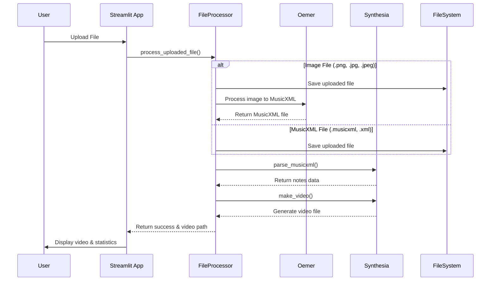
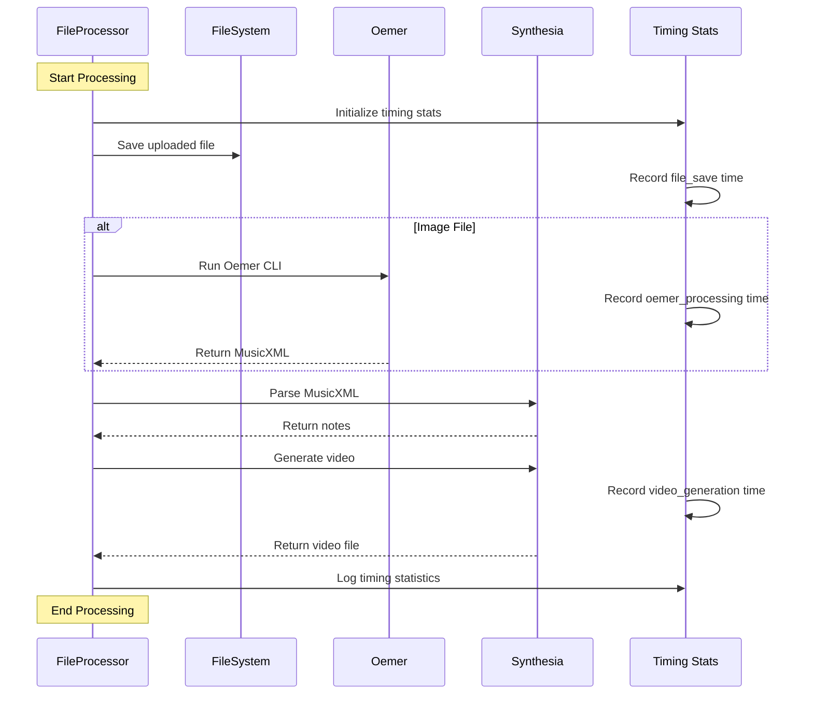
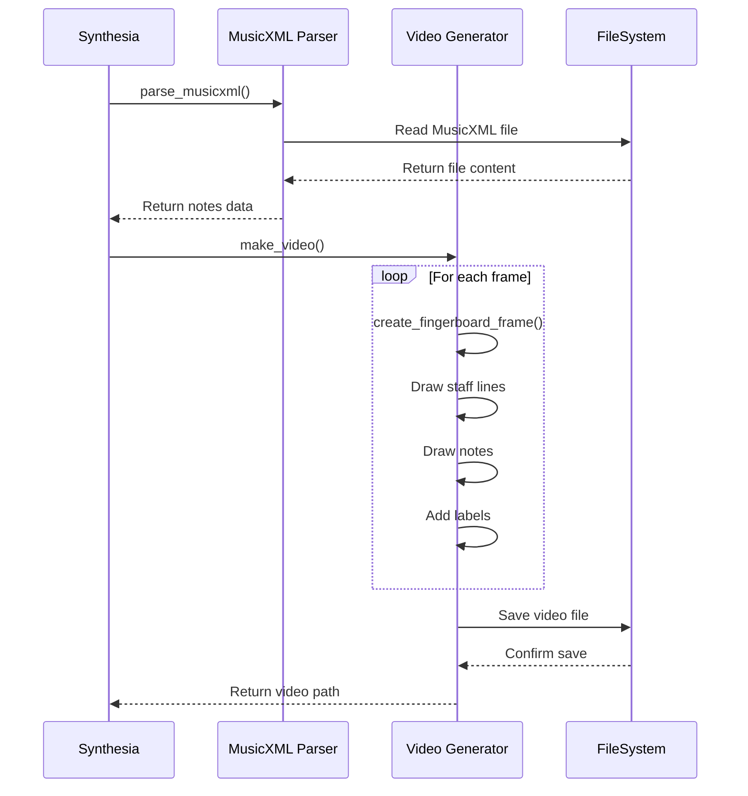
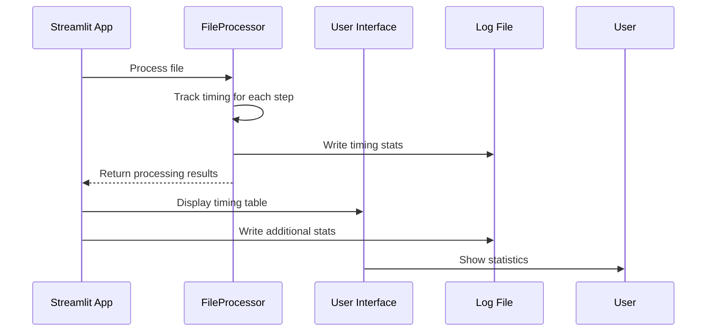
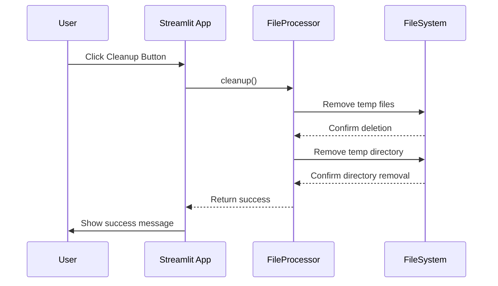

# Music Visualizer Application Sequence Diagram

## Main Application Flow

```mermaid
sequenceDiagram
    participant User
    participant Streamlit as Streamlit App
    participant FileProcessor
    participant Oemer
    participant Synthesia
    participant FileSystem

    User->>Streamlit: Upload File
    Streamlit->>FileProcessor: process_uploaded_file()
    
    alt Image File (.png, .jpg, .jpeg)
        FileProcessor->>FileSystem: Save uploaded file
        FileProcessor->>Oemer: Process image to MusicXML
        Oemer-->>FileProcessor: Return MusicXML file
    else MusicXML File (.musicxml, .xml)
        FileProcessor->>FileSystem: Save uploaded file
    end

    FileProcessor->>Synthesia: parse_musicxml()
    Synthesia-->>FileProcessor: Return notes data
    
    FileProcessor->>Synthesia: make_video()
    Synthesia-->>FileProcessor: Generate video file
    
    FileProcessor-->>Streamlit: Return success & video path
    Streamlit->>User: Display video & statistics
```

## File Processing Details

```mermaid
sequenceDiagram
    participant FP as FileProcessor
    participant FS as FileSystem
    participant O as Oemer
    participant S as Synthesia
    participant T as Timing Stats

    Note over FP: Start Processing
    FP->>T: Initialize timing stats
    
    FP->>FS: Save uploaded file
    T->>T: Record file_save time
    
    alt Image File
        FP->>O: Run Oemer CLI
        T->>T: Record oemer_processing time
        O-->>FP: Return MusicXML
    end
    
    FP->>S: Parse MusicXML
    S-->>FP: Return notes
    
    FP->>S: Generate video
    T->>T: Record video_generation time
    S-->>FP: Return video file
    
    FP->>T: Log timing statistics
    Note over FP: End Processing
```

## Video Generation Process

```mermaid
sequenceDiagram
    participant S as Synthesia
    participant P as MusicXML Parser
    participant V as Video Generator
    participant FS as FileSystem

    S->>P: parse_musicxml()
    P->>FS: Read MusicXML file
    FS-->>P: Return file content
    P-->>S: Return notes data
    
    S->>V: make_video()
    loop For each frame
        V->>V: create_fingerboard_frame()
        V->>V: Draw staff lines
        V->>V: Draw notes
        V->>V: Add labels
    end
    V->>FS: Save video file
    FS-->>V: Confirm save
    V-->>S: Return video path
```

## Timing Statistics Flow

```mermaid
sequenceDiagram
    participant App as Streamlit App
    participant FP as FileProcessor
    participant UI as User Interface
    participant Log as Log File

    App->>FP: Process file
    FP->>FP: Track timing for each step
    
    FP->>Log: Write timing stats
    FP-->>App: Return processing results
    
    App->>UI: Display timing table
    App->>Log: Write additional stats
    UI->>User: Show statistics
```

## Cleanup Process

```mermaid
sequenceDiagram
    participant User
    participant App as Streamlit App
    participant FP as FileProcessor
    participant FS as FileSystem

    User->>App: Click Cleanup Button
    App->>FP: cleanup()
    FP->>FS: Remove temp files
    FS-->>FP: Confirm deletion
    FP->>FS: Remove temp directory
    FS-->>FP: Confirm directory removal
    FP-->>App: Return success
    App->>User: Show success message
``` 